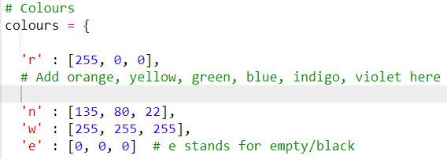

## Add colours

+ In the starter code, look for the the section called `colours` which contains this code:

```python
# Colours
colours = {

  'r' : [255, 0, 0],
  # Add orange, yellow, green, blue, indigo, violet here

  'n' : [135, 80, 22],
  'w' : [255, 255, 255],
  'e' : [0, 0, 0]  # e stands for empty/black

}
```

This is a **dictionary** of colours. Each colour has a letter (e.g. `r` for red) and a matching RGB colour list (e.g. `[255, 0, 0]`, which is red).

[[[generic-theory-simple-colours]]]

+ Copy the line `'r' : [255, 0, 0],`, and paste it immediately below itself. Change the `r` to an `o` for orange, and replace the RGB colour for red (`[255, 0, 0]`) with the RGB colour for orange. You can [look up here](https://www.w3schools.com/colors/colors_rgb.asp){:target="_blank"} which values you need.



+ Add the colours yellow (y), green (g), blue (b), indigo (i) and violet (v) in the same way.
