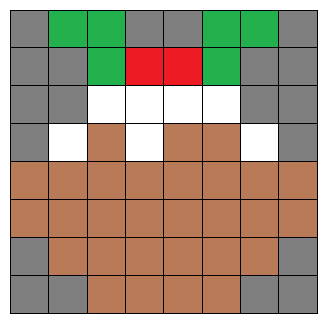
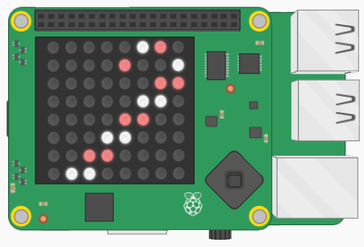

## Import the pictures

+ Open the `pictures.txt` file. This file contains the data for 25 different pictures which can be displayed on the Sense HAT's LED matrix.

For example, this is the second line in the file:

`e,g,g,e,e,g,g,e,e,e,g,r,r,g,e,e,e,e,w,w,w,w,e,e,e,w,n,w,n,n,w,e,
n,n,n,n,n,n,n,n,n,n,n,n,n,n,n,n,e,n,n,n,n,n,n,e,e,e,n,n,n,n,e,e`

Can you work out how this line of letters represents the following picture of a Christmas pudding?



--- collapse ---
---
title: Answer
---
Each letter in the line represents one of the colours you just created, so `e` means empty, `g` means green, `n` means brown, and so on.

Starting from the top left-hand pixel of the picture, the first eight letters represent the first row, the second eight represent the second row, and so on.

`e,g,g,e,e,g,g,e,
e,e,g,r,r,g,e,e,
e,e,w,w,w,w,e,e,
e,w,n,w,n,n,w,e,
n,n,n,n,n,n,n,n,
n,n,n,n,n,n,n,n,
e,n,n,n,n,n,n,e,
e,e,n,n,n,n,e,e`
--- /collapse ---

+ Locate the `pictures` section in your code, and add some code to open the `pictures.txt` file in read mode (`"r"`). This means that your program will be able to read data from the file.

```python
with open("pictures.txt", "r") as f:
```

+ Add one more line of code to read the whole file into a list called `all_pics`. Each line of the file will then become one item in the list.

```python
with open("pictures.txt", "r") as f:
  all_pics = f.readlines()
```

+ You can test whether this has worked by adding code to the **main program** section to clear the screen and display a picture of your choice. For example, this code will show picture 7, which is a candy cane:

```python
# ------------------------------------------------
# MAIN PROGRAM
# ------------------------------------------------
sense.clear()
display_pic(all_pics[7])
```



Note that the `display_pic()` function is not a built-in Python function. Instead, it has been written for you inside the starter file. It converts the string of letters from the file into a list of 64 RGB colours, so that the Sense HAT can display the picture.
