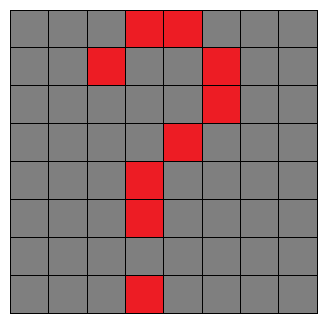

## Display the door

We need a picture to represent the closed door of the advent calendar. This is why the first line in the `pictures.txt` file represents a picture of a question mark.



+ Below the code where you opened the `pictures.txt` file, add a variable called `door` and set it equal to item 1 of the `all_pics` list. Make sure this line is **not** indented.

```python
door = all_pics[1]
```

+ Change the line of code in the **main program** section to display the picture of the door.

```python
display_pic(door)
```

+ Run your code. Do you see the picture of the question mark?

--- collapse ---
---
title: Answer
---
No, you will see the Christmas pudding image, which you already know is the second line in the file.

This is because **lists are indexed from 0**, so the first item in the list is actually item 0, not item 1! This might be confusing at first, but it is the way that most programming languages work.

So, the first item in the list — the question mark picture — is `all_pics[0]` and not `all_pics[1]`.
--- /collapse ---

+ Change your code so that the `door` variable refers to the question mark picture.
