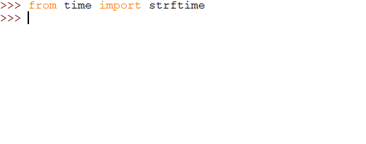

## What is the date?

To know which picture to display when you open the door, the program needs to know what the date is. Python has a built-in way of providing you with the current date.

+ Go to the **main section** of your program and create a variable called `day`. Using the `strftime` function, set the value of the variable to be the number of the current day of the month (e.g. `24` if it is the 24th).

[[[generic-python-strftime]]]

+ Repeat these instructions for another variable called `month`, so that it contains the current month name (e.g. `March` or `December`).

--- hints ---
--- hint ---
Look up the correct format string for what you want to see in the [strftime reference](http://strftime.org/){:target="_blank"}. For example, if you wanted to get the current day of the week, you would use the format string "%A".
--- /hint ---
--- hint ---
Plug in the format string you looked up into the `strftime` function, between the brackets:

```Python
day = strftime(    )
```
--- /hint ---
--- hint ---
Here is the code you will need:

```python
day = strftime("%d")
month = strftime("%B")
```
--- /hint ---
--- /hints ---

The function `strftime` is short for 'string format time', meaning the results you get back are always **strings**.

+ To check that you are getting the correct day and month you can print the results. Make sure to delete the print code once you are sure the day and month is being fetched correctly.

```python
print(day)
print(month)
```

+ Add code to the line containing your `day` variable to convert its value into an **integer**. For example, if today is the 24th, your variable will contain `"24"`, but we actually want it to contain `24`.

```python
day = int(strftime("%d"))
```

--- collapse ---
---
title: Why does this matter?
---
A **string** is a piece of text, whereas an **integer** is a whole number. We might want to perform calculations on numbers or compare them to each other.

Let's say we left the value of `day` as a string and today is the 23rd. If you asked Python to double that number, you would expect to get `"46"`. But as you can see below, that's not the case!



This is because the data is behaving like text, so two lots of `"23"` is `"2323"`. If we want `day` to behave like an integer, we must convert it to an integer.

--- /collapse ---
