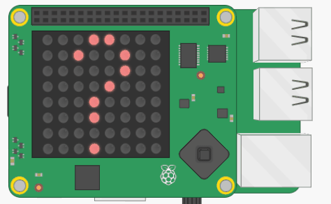

## Open the door

Now that your program knows the date, it can display the correct picture behind the door when the user presses the joystick.

+ Add some code to the **main program** to wait for the joystick to be pressed before detecting the current date. You have already written the last two lines of code, you just need to indent them:

```python
event = sense.stick.wait_for_event()
if event.action == "pressed" and event.direction == "middle":
  today = strftime("%d")
  month = strftime("%B")
```

If you are using the Sense HAT emulator, you can simulate pressing the joystick by pressing the "Enter" key on your keyboard instead.

You can display a message on the LED matrix using `show_message`.

[[[rpi-sensehat-show-message]]]

Let's check what date it is and show an appropriate message.

+ Add some code to do the following:
    - If the month is December and the day is any day before the 25th, display the day on the LED matrix using `show_message`
    - Else display the message "Keep waiting"

--- hints ---
--- hint ---
Here is some pseudo code to help you:
**If** the **month** equals **December** and the **day** is less than **25**
**Show message** - **day** (as a string)
**Else**
**Show message** - Keep waiting
--- /hint ---
--- hint ---
Here is the code you will need to add:

```python
if month == "December" and day < 25:
    sense.show_message(str(day))    # Convert day to a string
  else:
    sense.show_message("Keep waiting")
```
--- /hint ---
--- /hints ---

--- collapse ---
---
title: How can I test my code if it's not December?
---
Unless you are doing this project between 1st-24th December, you will always see the message "Keep waiting". If you want to test your message works properly for other dates, you can comment out the `strftime` part and put in a test day or month like this:

```python
day = 22 #int(strftime("%d"))
month = "December" #strftime("%B")
```

Once you're sure the code works, remove the test day and month and the `#` to return the code to normal.
--- /collapse ---

+ Finally, let's display the picture as well as showing today's date. Add some code to the `if` part to display the picture for days that are between 1st and 24th December, and wait with it on the screen for 5 seconds.

```python
if month == "December" and day < 25:
    sense.show_message(str(day))    # Convert day to a string
    display_pic(all_pics[day])
    sleep(5)
```



+ Finally, put all of the code in the **main program** section in an infinite loop so that it keeps running forever. Add this code at the start of the section and then indent everything else once so that it is inside the loop.

```python
while True:
```
